# Discovery GlobalCorp
## Analisi

L'azienda GlobalCorp è una realtà che conta più di 500 dipendenti suddivisi in cinque aree:

- Gestione delle strutture
- Sistemi informativi
- Data Warehouse

Ogni area ha un core business e una clientela definita, il che ha reso necessaria un'analisi approfondita con i vari referenti del Customer Care delle diverse aree. L'obiettivo era evidenziare le lacune del sistema di gestione dei visitatori attualmente utilizzato e proporre migliorie per la gestione dei nuovi flussi aziendali. In particolare, l'azienda desiderava un sistema che potesse gestire efficacemente il flusso di visitatori attraverso le sue numerose strutture, garantendo al contempo la sicurezza e la conformità alle normative sulla privacy. Questa analisi ha portato alla creazione di VisiTrack, un sistema di gestione dei visitatori progettato per soddisfare queste esigenze.

## Ricerca dell’utente
 Durante la mia visita in azienda, ho avuto l’opportunità di intervistare il personale della reception, il personale di sicurezza e alcuni visitatori frequenti. Ho scoperto che il sistema attuale di gestione dei visitatori è manuale e spesso causa ritardi. Il personale ha espresso il desiderio di un sistema automatizzato che possa velocizzare il processo e ridurre gli errori.

## Personas
 Sulla base della mia ricerca, ho identificato tre principali personas:

### Receptionist Rita: 

Rita è la responsabile della reception. Desidera un sistema che sia facile da usare e che possa velocizzare il processo di registrazione.

### Responsabile della sicurezza Paolo: 

Paolo ha bisogno di sapere chi è nell’edificio in ogni momento. Desidera un sistema che fornisca informazioni in tempo reale sui visitatori presenti nella struttura.

### Visitatore Alessandro: 

Alessandro è un fornitore che frequenta quotidianamente la struttura. Desidera un processo di check-in e check-out che sia rapido e rispetti la sua privacy.

## Focus Group

 Ho condotto un focus group con rappresentanti di ogni gruppo di personas. Hanno espresso il desiderio di un sistema che sia facile da usare e che rispetti la privacy dei visitatori. Hanno anche suggerito alcune funzionalità che ritengono importanti, come la possibilità di generare rapporti dettagliati sulla presenza dei visitatori.

## Storyboard:

- Il visitatore arriva alla struttura.
- Si dirige al terminale di check-in.
- Inserisce le sue informazioni personali nel terminale.
- Il sistema registra le informazioni del visitatore.
- Il visitatore entra nella struttura.
- Il visitatore utilizza i servizi della struttura.
- Quando è pronto per andarsene, il visitatore si dirige al terminale di check-out.
- Il visitatore inserisce le sue informazioni nel terminale per fare il check-out.
- Il sistema registra l’uscita del visitatore.
- Il visitatore lascia la struttura.

```mermaid
graph LR
A[Visitor Arrives] --> B[Go to Check-In Terminal]
B --> C[Enter Personal Information]
C --> D[System Records Visitor Information]
D --> E[Visitor Enters Facility]
E --> F[Visitor Uses Facility Services]
F --> G[Go to Check-Out Terminal]
G --> H[Enter Information for Check-Out]
H --> I[System Records Visitor's Exit]
I --> J[Visitor Leaves Facility]

```
  

## Customer Journey:

- Arrivo: Il visitatore arriva alla struttura e si dirige al terminale di check-in.
- Check-in: Il visitatore inserisce le sue informazioni personali nel terminale per fare il check-in.
- Entrata: Il visitatore entra nella struttura.
- Utilizzo dei servizi: Il visitatore utilizza i servizi della struttura.
- Check-out: Quando è pronto per andarsene, il visitatore si dirige al terminale di check-out e inserisce le sue informazioni per fare il check-out.
- Partenza: Il visitatore lascia la struttura.

 ```mermaid
graph LR
A[Arrival] --> B[Check-In]
B --> C[Entry]
C --> D[Use of Services]
D --> E[Check-Out]
E --> F[Departure]

```

## Service Blueprint:

- Terminale di check-in: Il visitatore inserisce le sue informazioni nel terminale di check-in. Queste informazioni vengono inviate al database dei visitatori.
Database dei visitatori: Il database registra le informazioni del visitatore e l’ora del check-in.
- Interfaccia di amministrazione: Il personale autorizzato può visualizzare le informazioni del visitatore e monitorare chi è attualmente nella struttura.
- Terminale di check-out: Quando il visitatore è pronto per andarsene, inserisce le sue informazioni nel terminale di check-out. Queste informazioni vengono inviate al database dei visitatori.
Database dei visitatori: Il database registra l’ora del check-out del visitatore.

 ```mermaid
graph LR
A[Check-In Terminal] --> B[Visitor Database]
B --> C[Admin Interface]
D[Check-Out Terminal] --> B

```

