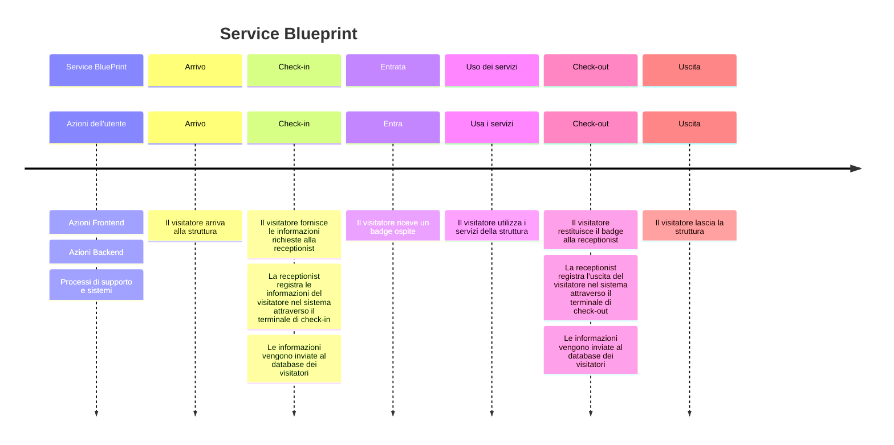

# Discovery GlobalCorp

## Analisi

L'azienda GlobalCorp è una realtà che conta più di 780 dipendenti suddivisi in tre aree:

- Sorveglianza
- Sistemi informativi
- Data Warehouse

Ogni area ha un core business e una clientela definita, il che ha reso necessaria un'analisi approfondita con i vari referenti del Customer Care delle diverse aree. L'obiettivo era evidenziare le lacune del sistema di gestione dei visitatori attualmente utilizzato e proporre migliorie per la gestione dei nuovi flussi aziendali. In particolare, l'azienda desiderava un sistema che potesse gestire efficacemente il flusso di visitatori attraverso le sue numerose strutture, garantendo al contempo la sicurezza e la conformità alle normative sulla privacy. Questa analisi ha portato alla creazione di VisiTrack, un sistema di gestione dei visitatori progettato per soddisfare queste esigenze.

## Ricerca dell’utente

Durante la mia visita in azienda, ho avuto l’opportunità di intervistare il personale della reception, il personale di sicurezza e alcuni visitatori frequenti. Ho scoperto che il sistema attuale di gestione dei visitatori è manuale e spesso causa ritardi. Il personale ha espresso il desiderio di un sistema automatizzato che possa velocizzare il processo e ridurre gli errori.

## Personas

Sulla base della mia ricerca, ho identificato tre principali personas:

### Receptionist Rita:

Rita è la responsabile della reception dell'HQ. Desidera un sistema che sia facile da usare e che possa velocizzare il processo di registrazione.

### Responsabile della sicurezza Paolo:

Paolo ha bisogno di sapere chi è nell’edificio in ogni momento. Desidera un sistema che fornisca informazioni in tempo reale sui visitatori presenti nella struttura.
Inoltre desidera avere un sistema di reportistica immediato che restituisca in un semplice grafico il numero di ospiti settimanali in struttura.

### Visitatore Alessandro:

Alessandro è un fornitore che frequenta quotidianamente la struttura. Desidera un processo di check-in e check-out che sia rapido e rispetti la sua privacy.

## Focus Group

Ho condotto un focus group con rappresentanti di ogni gruppo di personas. Hanno espresso il desiderio di un sistema che sia facile da usare e che rispetti la privacy dei visitatori.
Durante il focus group è emerso che sarebbe meglio far eseguire i check-in e check-out direttamente al receptionist. Non si vuol far perdere tempo al visitatore, che altrimenti dovrebbe familiarizzare con la procedura di check-in e inserire a mano tutte le sue info.
Hanno anche suggerito alcune funzionalità che ritengono importanti, come la possibilità di generare rapporti dettagliatisulla presenza dei visitatori. Paolo desidera che il sistema sia accessibile solo mediante credenziali da personaleGlobalCorp.
Potrebbe tornare utile una console di amministrazione degli utenti GlobalCorp abilitati al login, per gestirne l'aggiunta e la rimozione.
L'applicativo deve essere rapido e senza esposizioni pubbliche.

## Storyboard (visitor side):

- Il visitatore arriva alla struttura.
- Si dirige alla reception.
- La receptionist accoglie il visitatore e richiede alcune generalità.
- Il visitatore fornisce le informazioni richieste.
- La receptionist registra le informazioni del visitatore nel sistema.
- Il visitatore riceve un badge ospite.
- Il visitatore entra nella struttura.
- Il visitatore utilizza i servizi della struttura.
- Quando è pronto per andarsene, il visitatore si dirige alla reception.
- La receptionist richiede al visitatore di restituire il badge ospite.
- Il visitatore restituisce il badge.
- La receptionist registra l'uscita del visitatore nel sistema.
- Il visitatore lascia la struttura.

```mermaid
graph LR
A[Visitor Arrives] --> B[Go to Check-In Terminal]
B --> C[Enter Personal Information]
C --> D[System Records Visitor Information]
D --> E[Visitor Enters Facility]
E --> F[Visitor Uses Facility Services]
F --> G[Go to Check-Out Terminal]
G --> H[Enter Information for Check-Out]
H --> I[System Records Visitor's Exit]
I --> J[Visitor Leaves Facility]

```

## Service Blueprint:

- Terminale di check-in: Il visitatore arriva alla struttura e si dirige alla reception. La receptionist accoglie il visitatore e richiede alcune generalità. Il visitatore fornisce le informazioni richieste. La receptionist registra le informazioni del visitatore nel sistema attraverso il terminale di check-in. Queste informazioni vengono inviate al database dei visitatori. Il visitatore riceve un badge ospite.
- Database dei visitatori: Il database registra le informazioni del visitatore e l'ora del check-in.
- Lista visitatori: Il personale autorizzato può visualizzare le informazioni del visitatore e monitorare chi è attualmente nella struttura.
- Terminale di check-out: Quando il visitatore è pronto per andarsene, si dirige alla reception. La receptionist richiede al visitatore di restituire il badge ospite. Il visitatore restituisce il badge e la receptionist registra l'uscita del visitatore nel sistema attraverso il terminale di check-out. Queste informazioni vengono inviate al database dei visitatori.
- Database dei visitatori: Il database registra l'ora del check-out del visitatore.

